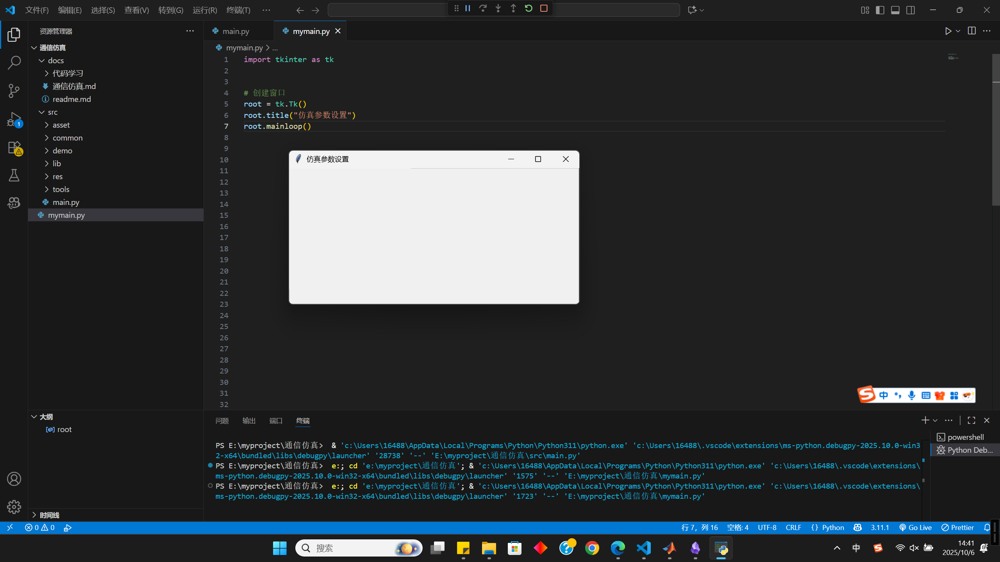
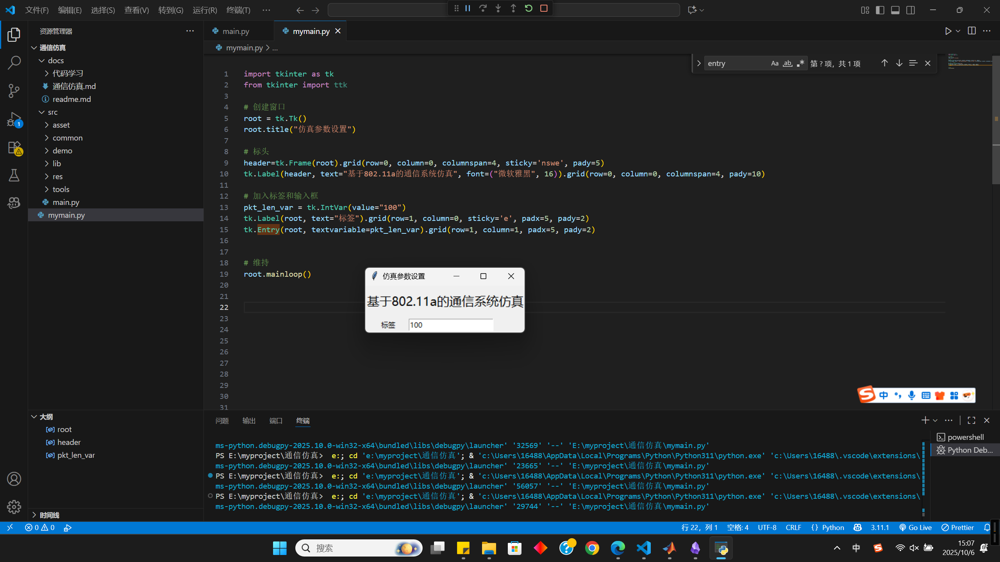
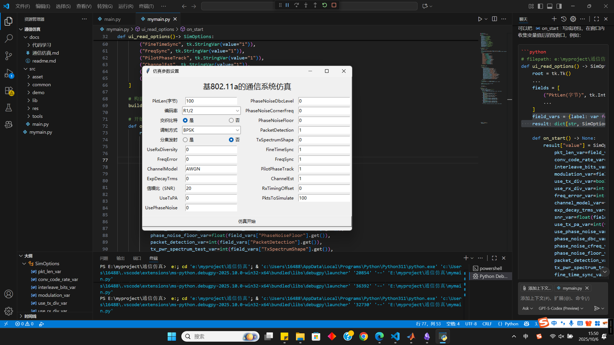
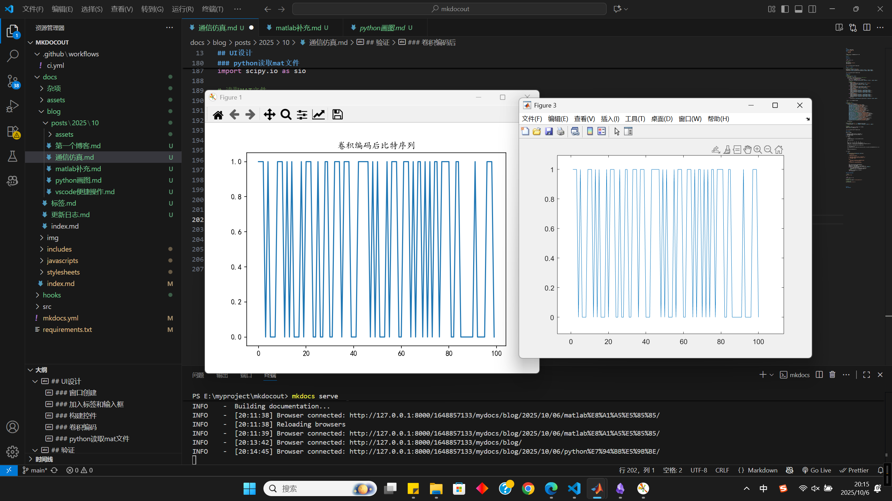

---
date:
  created: 2025-10-06
title: 802.11a功能实现
tags:
    - 通信系统
    - 802.11a
---

完成802.11a通信传输系统的python仿真实现
<!-- more -->

## UI设计

### 窗口创建

```py
import tkinter as tk

# 创建窗口
root = tk.Tk()
root.title("仿真参数设置")
root.mainloop()
```



### 加入标签和输入框
```py
# 加入标签和输入框
pkt_len_var = tk.IntVar(value="100")
tk.Label(root, text="标签").grid(row=1, column=0, sticky='e', padx=5, pady=2)
tk.Entry(root, textvariable=pkt_len_var).grid(row=1, column=1, padx=5, pady=2)
```



### 构建控件
```py
# 构建控件
def build_field(root, fields):
    # 布局控件
    num_per_col = (len(fields) + 1) // 2  # 每列显示的行数
    for i, (label, var) in enumerate(fields):
        col = 0 if i < num_per_col else 2
        row = i if i < num_per_col else i - num_per_col
        tk.Label(root, text=label).grid(row=row+1, column=col, sticky='e', padx=5, pady=2)

        # 特殊处理
        if(label=="编码率"):
            combo=ttk.Combobox(root,textvariable=var,state='readonly')
            combo['values']=('R1/2','R2/3','R3/4')
            combo.grid(row=row+1, column=col+1, padx=5, pady=2)
            combo.current(0)
        elif(label=="调制方式"):
            combo=ttk.Combobox(root,textvariable=var,state='readonly')
            combo['values']=('BPSK','QPSK','16QAM','64QAM')
            combo.grid(row=row+1, column=col+1, padx=5, pady=2)
            combo.current(0)
        elif(label=="分集发射"):
            combo=ttk.Radiobutton(root,text="是",variable=var,value=1)
            combo.grid(row=row+1, column=col+1, padx=5, pady=2, sticky='w')
            combo=ttk.Radiobutton(root,text="否",variable=var,value=0)
            combo.grid(row=row+1, column=col+1, padx=5, pady=2, sticky='e')
            var.set(0)
        elif(label=="交织比特"):
            combo=ttk.Radiobutton(root,text="是",variable=var,value=1)
            combo.grid(row=row+1, column=col+1, padx=5, pady=2, sticky='w')
            combo=ttk.Radiobutton(root,text="否",variable=var,value=0)
            combo.grid(row=row+1, column=col+1, padx=5, pady=2, sticky='e')
            var.set(1)
        else:
            tk.Entry(root, textvariable=var).grid(row=row+1, column=col+1, padx=5, pady=2)
```

加入仿真开始按钮并设置触发参数回调

```py
# 开始仿真按钮回调
def on_start() -> None:
    result["value"] = SimOptions(
        pkt_len_var=field_vars["PktLen(字节)"].get(),
        conv_code_rate_var=field_vars["编码率"].get(),
        interleave_bits_var=bool(field_vars["交织比特"].get()),
        modulation_var=field_vars["调制方式"].get(),
        use_tx_div_var=bool(field_vars["分集发射"].get()),
        use_rx_div_var=int(field_vars["UseRxDiversity"].get()),
        freq_error_var=int(field_vars["FreqError"].get()),
        channel_model_var=field_vars["ChannelModel"].get(),
        exp_decay_trms_var=float(field_vars["ExpDecayTrms"].get()),
        snr_var=float(field_vars["信噪比（SNR）"].get()),
        use_tx_pa_var=int(field_vars["UseTxPA"].get()),
        use_phase_noise_var=int(field_vars["UsePhaseNoise"].get()),
        phase_noise_dbc_var=float(field_vars["PhaseNoiseDbcLevel"].get()),
        phase_noise_cfreq_var=float(field_vars["PhaseNoiseCornerFreq"].get()),
        phase_noise_floor_var=float(field_vars["PhaseNoiseFloor"].get()),
        packet_detection_var=int(field_vars["PacketDetection"].get()),
        tx_pwr_spectrum_test_var=int(field_vars["TxSpectrumShape"].get()),
        fine_time_sync_var=int(field_vars["FineTimeSync"].get()),
        freq_sync_var=int(field_vars["FreqSync"].get()),
        pilot_phase_tracking_var=int(field_vars["PilotPhaseTrack"].get()),
        channel_estimation_var=int(field_vars["ChannelEst"].get()),
        rx_timing_offset_var=int(field_vars["RxTimingOffset"].get()),
        pkts_per_run_var=int(field_vars["PktsToSimulate"].get()),
    )
    root.destroy()

# 添加开始仿真按钮
tk.Button(root, text="仿真开始", command=on_start).grid(
    row=(len(fields) + 1) // 2+1, column=0, columnspan=4, sticky='we', pady=10
)

# 提取变量
field_vars = {label: var for label, var in fields}
result: dict[str, SimOptions] = {}
```



## 模块开发

### 卷积编码

假定初始为800bit

1. 卷积后长度 = 生成多项式长度 + 输入比特数 - 1
2. 800bit数据分别与2*7多项式卷积，同时模二计算
3. 结果按列展开后输出

=== "更改后"

    ```py
    def convolutional_encode(data_bits, para:Para):
        """卷积编码函数

        1. 卷积后长度 = 生成多项式长度 + 输入比特数 - 1
        2. 数据分别与多项式卷积，同时模二计算
        3. 结果按列展开后输出

        Args:
            data_bits (np.ndarray): 输入数据比特序列
            para (Para): 仿真参数封装类对象
        Returns:
            np.ndarray: 卷积编码后的比特序列
        """

        poly = para.sim_consts.ConvCodeGenPoly
        number_rows = poly.shape[0]
        number_bits = poly.shape[1] + len(data_bits) - 1
        uncoded_bits = np.zeros((number_rows, number_bits), dtype=int)
        for row in range(number_rows):
            conv_result = np.convolve(data_bits, poly[row])
            uncoded_bits[row, :] = np.mod(conv_result, 2)
        # 按列展开
        coded_bits = uncoded_bits.T.flatten()
        return coded_bits
    ```

=== "源代码"

    ```matlab
    function coded_bits = tx_conv_encoder(in_bits)

    global sim_consts;

    %1     0     1     1     0     1     1
    %1     1     1     1     0     0     1
    number_rows = size(sim_consts.ConvCodeGenPoly, 1);
    number_bits = size(sim_consts.ConvCodeGenPoly,2)+length(in_bits)-1;

    uncoded_bits = zeros(number_rows, number_bits);

    for row=1:number_rows
        uncoded_bits(row,1:number_bits)=rem(conv(in_bits, sim_consts.ConvCodeGenPoly(row,:)),2);
    end

    coded_bits=uncoded_bits(:);
    ```

### 删余

根据码率选择，返回对应的删余位置数组和窗口大小。

=== "更改后"

    ```py
    def get_punc_params(code_rate):
        """获取删余参数函数

        根据码率选择，返回对应的删余位置数组和窗口大小。

        Args:
            code_rate (str): 码率选择 ('R1/2', 'R2/3', 'R3/4')
        Returns:
            tuple: 删余位置数组和窗口大小
        """

        if code_rate == 'R3/4':
            # R = 3/4，删余模式：[1 2 3 x x 6]，x =删余
            punc_patt = np.array([1, 2, 3, 6])# 删除后余下的位置
            punc_patt_size = 6# 一组的数量
        elif code_rate == 'R2/3':
            # % R=2/3, 删余模式：[1 2 3 x], x = 删余
            punc_patt = np.array([1, 2, 3])
            punc_patt_size = 4
        elif code_rate == 'R1/2':
            # R=1/2, 删余模式：[1 2 3 4 5 6], x = 删余 
            punc_patt = np.array([1, 2, 3, 4, 5, 6])
            punc_patt_size = 6
        else:
            raise ValueError('未定义的编码率')
        return punc_patt, punc_patt_size
    ```

=== "源代码"

    ```matlab
    function [punc_patt, punc_patt_size] = get_punc_params(code_rate)

    if strcmp(code_rate,'R3/4')
      % R=3/4, Puncture pattern: [1 2 3 x x 6], x = punctured  R = 3/4，删余模式：[1 2 3 x x 6]，x =删余
      punc_patt=[1 2 3 6];%删除后余下的位置
      punc_patt_size = 6;%一组的数量
    elseif strcmp(code_rate, 'R2/3')
      % R=2/3, Puncture pattern: [1 2 3 x], x = punctured 
      punc_patt=[1 2 3]; 
      punc_patt_size = 4;
    elseif strcmp(code_rate, 'R1/2')
      % R=1/2, Puncture pattern: [1 2 3 4 5 6], x = punctured 
      punc_patt=[1 2 3 4 5 6];
      punc_patt_size = 6;
    else
      error('Undefined convolutional code rate');
    end
    ```

删余操作实际就是现根据速率确定删余的模式，也就是分组大小与删除位置，将输入数据几个一组。
可以想象成排列成矩阵，然后按位置统一去除，分组剩余的数据同样按照删余方式处理

=== "更改后"

    ```py
    def tx_puncture(in_bits, code_rate):
        """发射机删余函数

        依据码率获取删余窗口大小和保留位置
        计算尾部不足一窗的残余比特数
        对主数据按窗口重排成矩阵 puncture_table，仅保留 punc_patt 指定的行得到删余主数据 tx_table。
        对尾部残余比特按同一模式截取，得到 rem_punc_bits。
        将主数据和残余数据拼接成最终删余比特 punctured_bits。

        Args:
            in_bits (np.ndarray): 输入比特序列
            code_rate (str): 码率选择 ('R1/2', 'R2/3', 'R3/4')
        Returns:
            np.ndarray: 删余后的比特序列
        """

        # 获取删余模式和窗口大小
        punc_patt, punc_patt_size = get_punc_params(code_rate)
        num_rem_bits = len(in_bits) % punc_patt_size

        # 主数据分组删余
        main_bits = in_bits[:len(in_bits)-num_rem_bits]
        puncture_table = main_bits.reshape((-1, punc_patt_size)).T
        tx_table = puncture_table[punc_patt-1, :]  # MATLAB索引从1开始，Python从0开始

        # 剩余比特删余
        rem_bits = in_bits[len(in_bits)-num_rem_bits:]
        rem_punc_patt = np.where(punc_patt <= num_rem_bits)[0]
        rem_punc_bits = rem_bits[rem_punc_patt]

        # 拼接输出
        punctured_bits = np.concatenate([tx_table.T.flatten(), rem_punc_bits])
        return punctured_bits
    ```

=== "源代码"

    ```matlab
    % puncturing删余编码

    function punctured_bits = tx_puncture(in_bits, code_rate)

    [punc_patt, punc_patt_size] = get_punc_params(code_rate);
      % R=3/4 punc_patt=[1 2 3 6]; punc_patt_size = 6;
    % Remainder bits are the bits in the end of the packet that are not integer multiple of the puncture window size
    % 剩余比特是分组末尾的比特，它们不是删余窗口大小的整数倍
    num_rem_bits = rem(length(in_bits), punc_patt_size);%rem取余，把余下的bit单独运算

    puncture_table = reshape(in_bits(1:length(in_bits)-num_rem_bits), punc_patt_size, fix(length(in_bits)/punc_patt_size));
    %按punc_patt_siz分组
    tx_table = puncture_table(punc_patt,:);
    %按punc_patt得到删余后数据

    %puncture the remainder bits  删余剩余的比特
    rem_bits = in_bits(length(in_bits)-num_rem_bits+1:length(in_bits));
    rem_punc_patt = find(punc_patt<=num_rem_bits);
    rem_bits = rem_bits(rem_punc_patt,:);%自行添加
    rem_punc_bits = rem_bits( )';

    punctured_bits = [tx_table(:)' rem_punc_bits];
    ```

### 生成OFDM符号

根据调制阶数获得

=== "更改后"

    ```py
    def get_bits_per_symbol(mod_order: str) -> int:
        """根据调制方式获取每个符号的比特数

        Args:
            mod_order (str): 调制方式 ('BPSK', 'QPSK', '16QAM', '64QAM')
        Returns:
            int: 每个符号的比特数
        """

        mod_order = mod_order.strip().upper()
        if mod_order == 'BPSK':
            return 1
        elif mod_order == 'QPSK':
            return 2
        elif mod_order == '16QAM':
            return 4
        elif mod_order == '64QAM':
            return 6
        else:
            raise ValueError('未定义的调制方式')
    ```

=== "源代码"

    ```matlab
    function num_bits = get_bits_per_symbol(mod_order)

    if ~isempty(strmatch(mod_order, 'BPSK ','exact'))
      num_bits=1;
    elseif ~isempty(strmatch(mod_order, 'QPSK ','exact'))
      num_bits=2;
    elseif ~isempty(strmatch(mod_order, '16QAM','exact'))
      num_bits=4;
    elseif ~isempty(strmatch(mod_order, '64QAM','exact'))
      num_bits=6;
    else
      error('Undefined modulation');
    end
    ```

计算当前数据可以生成多少OFDM符号，如果发射分集要保证符号数为偶数，确定填充的bit进行填充

=== "更改后"

    ```py
    def tx_make_int_num_ofdm_syms(tx_bits, para: Para):
        """生成整数个OFDM符号的比特序列函数

        计算需要的OFDM符号数，确保数据比特数能填满整数个OFDM符号。
        如果启用发射分集且OFDM符号数为奇数，则增加一个OFDM符号以确保符号数为偶数。
        计算需要填充的比特数，并生成随机填充比特。
        将原始比特序列与填充比特拼接，得到最终的比特序列。

        Args:
            tx_bits (np.ndarray): 输入比特序列
            para (Para): 仿真参数封装类对象
        Returns:
            np.ndarray: 填充后的比特序列
        """
        sim_consts = para.sim_consts
        sim_options = para.ui_options

        n_tx_bits = len(tx_bits)
        n_syms = sim_consts.NumDataSubc
        n_bits_per_sym = get_bits_per_symbol(sim_options.Modulation)

        # 计算需要的OFDM符号数
        n_ofdm_syms = int(np.ceil(n_tx_bits / (n_syms * n_bits_per_sym)))

        # Radon Hurwitz变换需要偶数个OFDM符号
        if sim_options.UseTxDiversity:
            if n_ofdm_syms % 2 != 0:
                n_ofdm_syms += 1

        pad_len = n_ofdm_syms * n_syms * n_bits_per_sym - n_tx_bits
        pad_bits = np.random.randint(0, 2, pad_len) # 随机生成{0,1}填充比特
        out_bits = np.concatenate([tx_bits, pad_bits])
        return out_bits
    ```

=== "源代码"

    ```matlab
    function out_bits = tx_make_int_num_ofdm_syms(tx_bits, sim_options)%tx_bits是删余后的数据

    global sim_consts;

    n_tx_bits = length(tx_bits);

    n_syms = sim_consts.NumDataSubc;%48
    n_bits_per_sym = get_bits_per_symbol(sim_options.Modulation);%1,2,4,6
    n_ofdm_syms = ceil(n_tx_bits/(n_syms*n_bits_per_sym));

    % if Radon Hurwitz transform is used we need an even number of OFDM symbols
    %如果使用Radon Hurwitz变换，我们需要偶数个OFDM符号
    if sim_options.UseTxDiv
      if rem(n_ofdm_syms,2) ~= 0
          n_ofdm_syms = n_ofdm_syms + 1;
      end
    end

    pad_bits = randn(1, n_ofdm_syms*n_syms*n_bits_per_sym - n_tx_bits) > 0;
    out_bits = [tx_bits  pad_bits];
    ```


## 验证
### python读取mat文件

```shell
pip install scipy
```

```py
import scipy.io as sio

# 读取MAT文件
mat_data = sio.loadmat('src/dat/inputdat.mat')

# 打印数据内容
print(mat_data['inf_bits'])
```

### 卷积编码后




