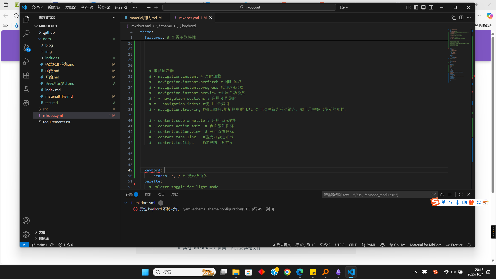

## 创建网站
### 初始化文件夹
```shell
mkdocs new .
```

得到
```
.
├─ docs/
│  └─ index.md
└─ mkdocs.yml
```

### 基本配置
```yaml
site_name: My site
site_url: https://mydomain.org/mysite
theme:
  name: material
```

### YAML扩展
setting.json增加
```json
{
  "yaml.schemas": {
    "https://squidfunk.github.io/mkdocs-material/schema.json": "mkdocs.yml"
  },
  "yaml.customTags": [ 
    "!ENV scalar",
    "!ENV sequence",
    "!relative scalar",
    "tag:yaml.org,2002:python/name:material.extensions.emoji.to_svg",
    "tag:yaml.org,2002:python/name:material.extensions.emoji.twemoji",
    "tag:yaml.org,2002:python/name:pymdownx.superfences.fence_code_format",
    "tag:yaml.org,2002:python/object/apply:pymdownx.slugs.slugify mapping"
  ]
}
```





对对对ddd


## 小技巧

### 提示
```md
!!!note "提示"
    文字说明
```

### 分栏代码
=== "简介"

    ``` md
    
    ```

=== "代码"

    ``` md
    === ":octicons-file-code-16: `docs/stylesheets/extra.css`"

        ``` css
        @font-face {
          font-family: "<font>";
          src: "...";
        }
        ```

    === ":octicons-file-code-16: `mkdocs.yml`"

        ``` yaml
        extra_css:
          - stylesheets/extra.css
        ```
    ```

## 更改颜色

[谷歌颜色盘](http://www.materialui.co/colors)

### 光亮模式和黑暗模式
```yml
theme:
  palette:
    # scheme: slate
    scheme: default
```

点击切换模式
??? info "代码"

    ```javascript
    <div class="mdx-switch">
      <button data-md-color-scheme="default"><code>default</code></button>
      <button data-md-color-scheme="slate"><code>slate</code></button>
    </div>

    <script>
      var buttons = document.querySelectorAll("button[data-md-color-scheme]")
      buttons.forEach(function(button) {
        button.addEventListener("click", function() {
          document.body.setAttribute("data-md-color-switching", "")
          var attr = this.getAttribute("data-md-color-scheme")
          document.body.setAttribute("data-md-color-scheme", attr)
          var name = document.querySelector("#__code_0 code span.l")
          name.textContent = attr
          setTimeout(function() {
            document.body.removeAttribute("data-md-color-switching")
          })
        })
      })
    </script>
    ```

<div class="mdx-switch">
  <button data-md-color-scheme="default"><code>default</code></button>
  <button data-md-color-scheme="slate"><code>slate</code></button>
</div>

<script>
  var buttons = document.querySelectorAll("button[data-md-color-scheme]")
  buttons.forEach(function(button) {
    button.addEventListener("click", function() {
      document.body.setAttribute("data-md-color-switching", "")
      var attr = this.getAttribute("data-md-color-scheme")
      document.body.setAttribute("data-md-color-scheme", attr)
      var name = document.querySelector("#__code_0 code span.l")
      name.textContent = attr
      setTimeout(function() {
        document.body.removeAttribute("data-md-color-switching")
      })
    })
  })
</script>

### 基本颜色

```yml
theme:
  palette:
    primary: indigo
```

点击切换颜色
??? info "代码"

    ```js
    <div class="mdx-switch">
      <button data-md-color-primary="red"><code>red</code></button>
      <button data-md-color-primary="pink"><code>pink</code></button>
      <button data-md-color-primary="purple"><code>purple</code></button>
      <button data-md-color-primary="deep-purple"><code>deep purple</code></button>
      <button data-md-color-primary="indigo"><code>indigo</code></button>
      <button data-md-color-primary="blue"><code>blue</code></button>
      <button data-md-color-primary="light-blue"><code>light blue</code></button>
      <button data-md-color-primary="cyan"><code>cyan</code></button>
      <button data-md-color-primary="teal"><code>teal</code></button>
      <button data-md-color-primary="green"><code>green</code></button>
      <button data-md-color-primary="light-green"><code>light green</code></button>
      <button data-md-color-primary="lime"><code>lime</code></button>
      <button data-md-color-primary="yellow"><code>yellow</code></button>
      <button data-md-color-primary="amber"><code>amber</code></button>
      <button data-md-color-primary="orange"><code>orange</code></button>
      <button data-md-color-primary="deep-orange"><code>deep orange</code></button>
      <button data-md-color-primary="brown"><code>brown</code></button>
      <button data-md-color-primary="grey"><code>grey</code></button>
      <button data-md-color-primary="blue-grey"><code>blue grey</code></button>
      <button data-md-color-primary="black"><code>black</code></button>
      <button data-md-color-primary="white"><code>white</code></button>
    </div>

    <script>
      var buttons = document.querySelectorAll("button[data-md-color-primary]")
      buttons.forEach(function(button) {
        button.addEventListener("click", function() {
          var attr = this.getAttribute("data-md-color-primary")
          document.body.setAttribute("data-md-color-primary", attr)
          var name = document.querySelector("#__code_1 code span.l")
          name.textContent = attr.replace("-", " ")
        })
      })
    </script>
    ```

<div class="mdx-switch">
  <button data-md-color-primary="red"><code>red</code></button>
  <button data-md-color-primary="pink"><code>pink</code></button>
  <button data-md-color-primary="purple"><code>purple</code></button>
  <button data-md-color-primary="deep-purple"><code>deep purple</code></button>
  <button data-md-color-primary="indigo"><code>indigo</code></button>
  <button data-md-color-primary="blue"><code>blue</code></button>
  <button data-md-color-primary="light-blue"><code>light blue</code></button>
  <button data-md-color-primary="cyan"><code>cyan</code></button>
  <button data-md-color-primary="teal"><code>teal</code></button>
  <button data-md-color-primary="green"><code>green</code></button>
  <button data-md-color-primary="light-green"><code>light green</code></button>
  <button data-md-color-primary="lime"><code>lime</code></button>
  <button data-md-color-primary="yellow"><code>yellow</code></button>
  <button data-md-color-primary="amber"><code>amber</code></button>
  <button data-md-color-primary="orange"><code>orange</code></button>
  <button data-md-color-primary="deep-orange"><code>deep orange</code></button>
  <button data-md-color-primary="brown"><code>brown</code></button>
  <button data-md-color-primary="grey"><code>grey</code></button>
  <button data-md-color-primary="blue-grey"><code>blue grey</code></button>
  <button data-md-color-primary="black"><code>black</code></button>
  <button data-md-color-primary="white"><code>white</code></button>
</div>

<script>
  var buttons = document.querySelectorAll("button[data-md-color-primary]")
  buttons.forEach(function(button) {
    button.addEventListener("click", function() {
      var attr = this.getAttribute("data-md-color-primary")
      document.body.setAttribute("data-md-color-primary", attr)
      var name = document.querySelector("#__code_1 code span.l")
      name.textContent = attr.replace("-", " ")
    })
  })
</script>

### 颜色切换
```yml
theme:
  palette: 

    # Palette toggle for light mode
    - scheme: default
      toggle:
        icon: material/brightness-7 
        name: Switch to dark mode

    # Palette toggle for dark mode
    - scheme: slate
      toggle:
        icon: material/brightness-4
        name: Switch to light mode
```

#### icon属性
切换键前后图标

* :material-brightness-7: + :material-brightness-4: – `material/brightness-7` + `material/brightness-4`
* :material-toggle-switch: + :material-toggle-switch-off-outline: – `material/toggle-switch` + `material/toggle-switch-off-outline`
* :material-weather-night: + :material-weather-sunny: – `material/weather-night` + `material/weather-sunny`
* :material-eye: + :material-eye-outline: – `material/eye` + `material/eye-outline`
* :material-lightbulb: + :material-lightbulb-outline: – `material/lightbulb` + `material/lightbulb-outline`

#### name属性
主要用于提示的作用，任意命名

### 定制

#### 定制颜色
首先设置`custom`属性
```yml
theme:
  palette:
    primary: custom
```

编写css文件并引入

```css
:root  > * {
  --md-primary-fg-color:        #EE0F0F;
  --md-primary-fg-color--light: #ECB7B7;
  --md-primary-fg-color--dark:  #90030C;
}
```

```yml
extra_css:
  - stylesheets/extra.css
```

命名自定义属性
```css
[data-md-color-scheme="youtube"] {
  --md-primary-fg-color:        #EE0F0F;
  --md-primary-fg-color--light: #ECB7B7;
  --md-primary-fg-color--dark:  #90030C;
}
```

```yml
theme:
  palette:
    scheme: youtube
extra_css:
  - stylesheets/extra.css
```

## 改变字体
### 常规字体
参考[谷歌字体](https://www.googlefonts.cn/chinese)

```yml
theme:
  font:
    text: Roboto
```

### 等宽字体
用于代码块，可以单独配置，参考谷歌字体
```yml
theme:
  font:
    code: Roboto Mono
```

### 定制
使用另外的字体

先引入
=== ":octicons-file-code-16: `docs/stylesheets/extra.css`"

    ``` css
    @font-face {
      font-family: "<font>";
      src: "...";
    }
    ```

=== ":octicons-file-code-16: `mkdocs.yml`"

    ``` yaml
    extra_css:
      - stylesheets/extra.css
    ```
之后可以使用

=== "Regular font"

    ``` css
    :root {
      --md-text-font: "<font>"; /* (1)! */
    }
    ```

=== "Monospaced font"

    ``` css
    :root {
      --md-code-font: "<font>";
    }
    ```

## 更改icon和logo

```yml
theme:
  logo: assets/logo.png
```

## 扩展
### 缩写
启用
```yml
markdown_extensions:
  - abbr
```
用法

```md
The HTML specification is maintained by the W3C.

*[HTML]: Hyper Text Markup Language
*[W3C]: World Wide Web Consortium
```

The HTML specification is maintained by the W3C.

*[HTML]: Hyper Text Markup Language
*[W3C]: World Wide Web Consortium

#### 术语表

=== ":octicons-file-code-16: `docs/includes/abbr.md`"

    ``` css
    *[HTML]: Hyper Text Markup Language
    *[W3C]: World Wide Web Consortium
    ```

=== ":octicons-file-code-16: `mkdocs.yml`"

    ``` yaml
    markdown_extensions:
    - pymdownx.snippets:
        auto_append:
          - docs/includes/abbr.md
    ```

!!!note "注意"

    缩写词前后需要加上空格

缩写词测试， HTML5 


缩写词测试， CSS 

### 警示
启用
```yml
markdown_extensions:
  - admonition
```

#### 直接使用
```md
!!! note

    说明
```
!!! note

    说明

#### 自定义标题
```md
!!! note "标题"

    说明
```

!!! note "标题"

    说明

#### 嵌套
```md
!!! note "标题1"

    说明1

    !!! note "标题2"

        说明2
```

!!! note "标题1"

    说明1

    !!! note "标题2"

        说明2

#### 无标题
```md
!!! note ""

    说明
```

!!! note ""

    说明

#### 可折叠

??? note

    说明

#### 内联
=== ":octicons-arrow-right-16: 内联右"

    !!! info inline end "标题"

        说明

    ``` markdown
    !!! info inline end "标题"

        说明
    ```

=== ":octicons-arrow-left-16: 内联"

    !!! info inline "标题"

        说明
    ``` markdown
    !!! info inline "标题"

        说明
    ```

#### 支持的类型
``` md
!!! note

    说明
```

!!! note

    说明

``` md
!!! abstract

    说明
```

!!! abstract

    说明

```md
!!! info

    说明
```

!!! info

    说明

```md
!!! tip

    说明
```

!!! tip

    说明

```md
!!! success

    说明
```

!!! success

    说明

```md
!!! question

    说明
```

!!! question

    说明

```md
!!! warning

    说明
```

!!! warning

    说明

```md
!!! failure

    说明
```

!!! failure

    说明

```md
!!! danger

    说明
```

!!! danger

    说明

```md
!!! bug

    说明
```

!!! bug

    说明

```md
!!! example

    说明
```

!!! example

    说明

```md
!!! quote

    说明
```

!!! quote

    说明


#### 自定义
```yaml
theme
  icon: 
    admonition: # 告警图标,可自定义
      note: octicons/tag-16
      abstract: octicons/checklist-16
      info: octicons/info-16
      tip: octicons/squirrel-16
      success: octicons/check-16
      question: octicons/question-16
      warning: octicons/alert-16
      failure: octicons/x-circle-16
      danger: octicons/zap-16
      bug: octicons/bug-16
      example: octicons/beaker-16
      quote: octicons/quote-16
```


## 博客
### 模板
=== "目录"

    ```md
    docs
    ├── blog
    │   ├── index.md
    │   └── posts
    └── index.md
    ```

=== "代码"

    ```md
    ---
    date:
      created: 2023-12-31
    ---

    # 标题

    摘要
    <!-- more -->

    正文
    ```

### 更新文章
```md hl_lines="3 4"
---
date:
  created: 2023-12-31
  updated: 2024-01-02
---
```

### 置顶
```md
---
date:
  created: 2023-12-31
  updated: 2024-01-02
readtime: 15
pin: true
---
```

### 链接
```md
---
date:
  created: 2023-12-31
...
links:
  - index.md
  - blog/index.md
---
```

!!! note "自定义标题"

    ```md
    ---
    date:
      created: 2023-12-31
    ...
    links:
      - Homepage: index.md
      - Blog index: blog/index.md
      - External links:
        - Material documentation: https://squidfunk.github.io/mkdocs-material
    ---
    ```


## 验证
### 中文搜索支持
```
pip install jieba
```

```yaml
plugins:
  - search:
      separator: '[\s\u200b\-]'
```


